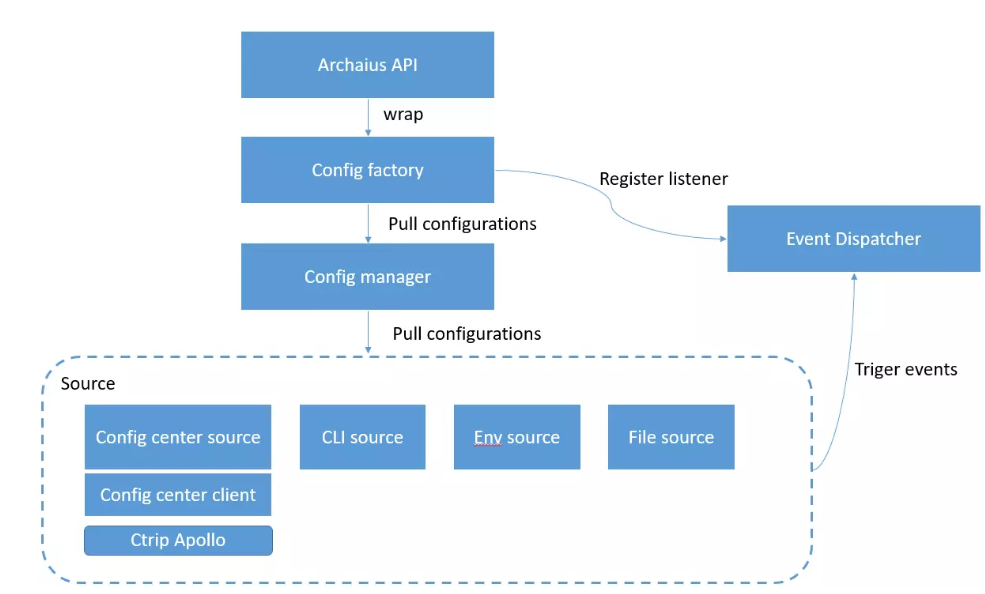

### go-archaius
[](https://travis-ci.org/ServiceComb/go-archaius)



This is a dynamic configuration management tool for Go-Chassis which helps in configuration
management for micro-services developed using Go-Chassis. 

Meanwhile go-archaius is also decoupled with go chassis, it can be used in any projects.

The main objective of this project is to pull or sync the configuration from config-sources for a particular
micro-service.

### Why use go-archaius
it is hard to manage configurations in a distributed system. archaius can integrate with them. Tt  keeps watching configuration changes, and fire change event if there is changes. 
so that you can easily implement a service which has hot-reconfiguration features. when you need to change configurations. you service has zero-down time

### Sources
Go-Archaius  supports multiple sources for the configuration.

1. Command Line Sources - You can give the configurations key and values in the command lines arguments 
while starting the microservice.
2. Environment Variable Sources - You can specify the sources of conifguration in Environment variable.
3. External Sources - You can also specify the configuration sources to be some 
external config server from where the client can pull the configuration.
4. Files Sources - You can specify some specific files from where client can read 
the configuration for the microservices.

You can specify multiple sources at a same time. go-archaius keeps all 
the sources marked with their precedence,  in case if two sources have same config
then source with higher precendence will be selected.

### Event management
You can register event listener by key(exactly match or pattern match), to watch value change.

 

### Example: Manage local configurations 
Complete [example](https://github.com/go-chassis/go-archaius/tree/master/examples/file)

### Example: Manage runtime configurations by Remote Config Server
import a config client implementation
```go
import _ "github.com/go-chassis/go-cc-client/configcenter"
```
give config center information to init config center source
```go
	ci := archaius.ConfigCenterInfo{
	//input your config center source config
	}
	//create config client 
	cc:=ccclient.NewClient("config_center",ccclient.Options{
    		ServerURI:"the address of config server endpoint",
    	})
	//manage local and remote key value at same time
	err = archaius.Init(
		archaius.WithRequiredFiles([]string{filename1}),
		archaius.WithOptionalFiles([]string{filename2}),
		archaius.WithConfigCenterSource(ci, cc),
	)
```

To check config server that archaius supports, 
access https://github.com/go-chassis/go-cc-client